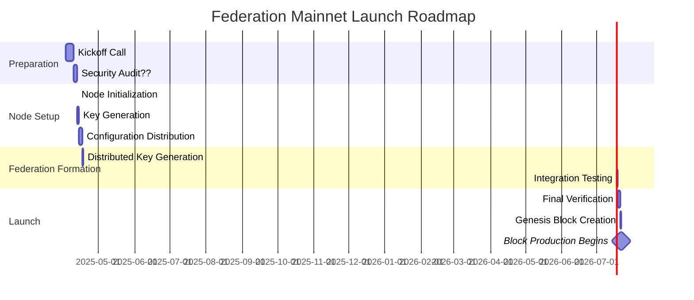

# Federation Roadmap for Mainnet Launch

This document outlines the step-by-step process for federation members to prepare for and participate in the mainnet launch.

## Timeline Overview



## Detailed Steps

### 1. Federation Member Onboarding

- [ ] Complete KYC/AML requirements
- [ ] Establish secure communication channels
- [ ] Attend kickoff call/meeting

### 2. Hardware & Infrastructure Setup

- [ ] Procure recommended server hardware meeting specifications
- [ ] Set up physical or cloud infrastructure with security measures
- [ ] Configure networking with firewall rules as specified
- [ ] Implement backup solutions

### 3. Node Initialization

- [ ] Install required software packages
- [ ] Set up Bitcoin Core node and synchronize with mainnet
- [ ] Initialize Reth node with federation-specific parameters
- [ ] Initialize CometBFT consensus node
- [ ] Configure monitoring and alerting systems

### 4. Key Generation Phase

- [ ] Generate node identity keys for Reth node

```bash
    in-view
```

- [ ] Generate validator keys for CometBFT node

```bash
  cometbft init -k "secp256k1" --home /path/to/cometbft
```

- [ ] Securely store generated key material with hardware backups
- [ ] Configure HSM for storing sensitive key material
- [ ] Transmit public keys and node information to federation coordinator(Botanix)

### 5. Configuration Distribution

- [ ] Receive `genesis.json` and `config.toml` from federation coordinator
- [ ] Verify file integrity using provided checksums

```bash
sha256sum -c checksums.txt
```

- [ ] Install configuration files to appropriate locations

```bash
cp genesis.json /path/to/cometbft/config/
cp chain.toml /path/to/reth/
cp config.toml /path/to/bitcoin-signer/config/
```

- [ ] Validate configuration with preflight checks

### 6. Distributed Key Generation (DKG)

- [ ] Final security review of all systems
- [ ] Verify sync status of Bitcoind client
- [ ] Participate in scheduled DKG
- [ ] Verify threshold parameters (11/15 signature scheme)
- [ ] Confirm HSM and key material availability **

```bash
  ## Node deployment to initialise dkg
```

- [ ] Verify key shares and federation membership
- [ ] Store key shares securely in HSM or encrypted database **

### 7. Integration Testing

- [ ] Verify monitoring and alerting functionality

### 9. Genesis and Block Production

- [ ] genesis block creation
- [ ] Confirm block signing capability
- [ ] Monitor initial block production
- [ ] Verify transaction processing capability
- [ ] Perform test transactions across components
- [ ] Validate block production participation

## Launch Checklist

| Requirement | Description | Status |
|-------------|-------------|--------|
| Hardware | Meet minimum specifications | ⬜ |
| Network | Stable connection with required ports open | ⬜ |
| Bitcoin Node | Fully synced mainnet node | ⬜ |
| Reth Node | Initialized with correct chain spec | ⬜ |
| CometBFT | Configured with correct genesis | ⬜ |
| Key Material | Securely stored with backups | ⬜ |
| HSM | Configured and operational | ⬜ |
| Monitoring | monitoring dashboards operational | ⬜ |
| Security | Firewall and access controls in place | ⬜ |
| Backup | Regular backup procedure established | ⬜ |
